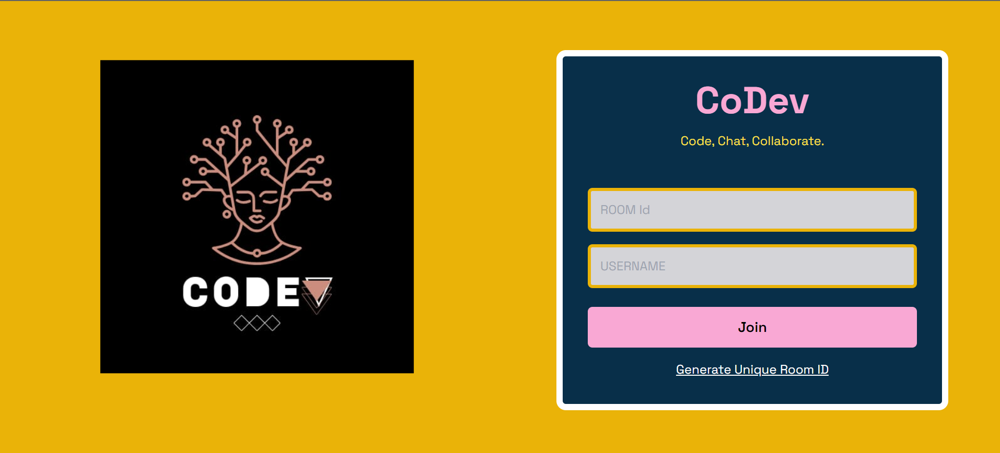
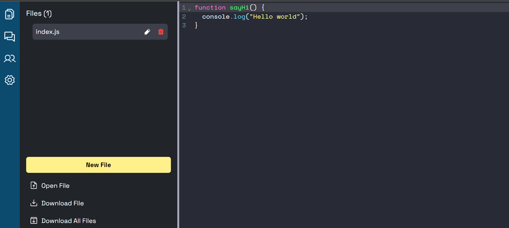
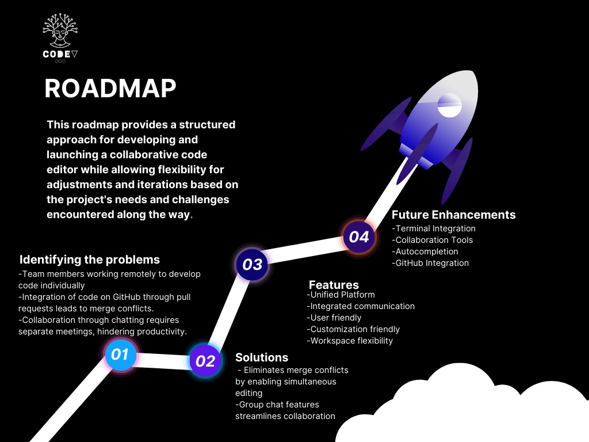

# CoDev - A Realtime Code Editor



CoDev (Collaborative Development) is a collaborative, real-time code editor where users can seamlessly code together. It provides a platform for multiple users to enter a room, share a unique room ID, and collaborate on code simultaneously.

## 🔮 Features

-   💻 Enable real-time code collaboration across multiple files simultaneously.
-   🚀 Generate unique rooms with IDs for seamless collaboration.
-   🌈 Provide syntax highlighting for various file types with automatic language detection.
-   💡 Offer auto-suggestions tailored to the programming language being used.
-   ⏱️ Ensure instant updates and synchronization of code changes across all files.
-   📣 Notify users of join and leave events during collaboration.
-   🎨 Allow for multiple themes to personalize the coding experience.
-   🌍 Support a wide range of programming languages for versatility.
-   🔠 Provide options to adjust font size and family for user preference.
-   👥 Display a user presence list indicating who is currently online/offline in the collaboration session.
-   📁 Enable functionalities for opening, editing, saving, and deleting files.
-   💾 Allow users to download files edited within the collaboration session.
-   💬 **Group chatting** facilitates real-time communication while collaborating on code.

## 🚀 Live Preview

You can view the live preview of the project [here](https://co-dev-one.vercel.app/).

## 💻 Tech Stack




## ⚙️ Installation

1. **Fork this repository:** Click the Fork button located in the top-right corner of this page to fork the repository.
2. **Clone the repository:**
    ```bash
    git clone https://github.com/<your-username>/coDev.git
    ```
3. **Set .env file:**
   Inside the client and server directory, create or edit the .env file and add the following line:  
   Frontend:

    ```bash
    VITE_BACKEND_URL=<your_server_url>
    ```

    Backend:

    ```bash
    PORT=3000
    ```

4. **Install dependencies:**
   Navigate to the frontend and backend directories separately and run:
    ```bash
     npm install
    ```
5. **Start the frontend and backend servers:**  
   Frontend:
    ```bash
    cd client
    npm run dev
    ```
    Backend:
    ```bash
    cd server
    npm run dev
    ```
6. **Access the application:**
   Open a browser and enter the following URL:
    ```bash
    http://localhost:5173/
    ```

## 🔮 Future Enhancements:
**1) Terminal Integration:**
   - Access a terminal within the editor to view code output, enhancing the development experience.

**2) Collaboration Tools:**
   - Introduce a whiteboard and video calling feature within the editor room, facilitating real-time communication and brainstorming.

**3) Autocompletion:**
   - Implement an autocompletion feature, inspired by Copilot, to assist developers with code suggestions and enhancements.

**4) GitHub Integration:**
   - Enable direct integration with GitHub, allowing seamless code pushing from the editor room without the need for external IDEs like VSCode.


## 📈 Roadmap




## 🧾 License

This project is licensed under the [MIT License](LICENSE).
